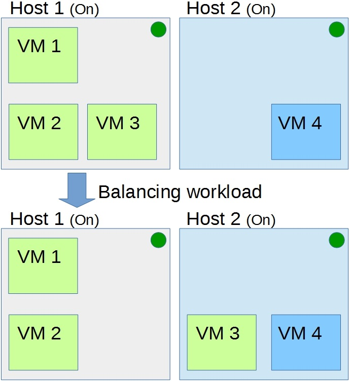
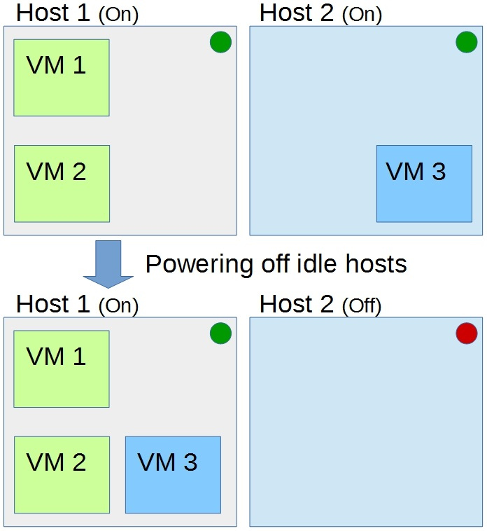

###Project stats: 

Autonomiccs platform is open source software that provides the vital components needed to manage a cloud computing environment autonomously; we act at the infrastructure as a service level by providing a plugin to <a href="https://github.com/apache/cloudstack">Apache CloudStack</a>.

Our mission is to take the orchestration of cloud computing infrastructures to the next level. To achieve that, we developed a distributed and autonomic plugin that can monitor the CC environment and take decisions in order to fulfill the goals of the given environment. We do not wish to remove the need for human administrators, but to improve their work. Our mission is to optimize and make CC environments more efficient and stable without needing to rely on human administrators.

The plugin is stable on CloudStack 4.6 and beyond, and was designed to have a smooth installation and upgrade process. Currently, all algorithms that do not shut down idle hosts are working with every type of hypervisor supported by ACS; however, the consolidation algorithms are available only for XenServer and XCP (it is a question of time and resources to implement for all hypervisors supported by ACS).

## Motivation

Over the past years, cloud computing (CC) usage has increased. To meet that demand the infrastructure required to create and maintain CC environments grows constantly, which impacts on management costs. Thus, the optimization of those environments has become infeasible to humans administrators, requiring an autonomic approach.

Even so, we still do not see autonomic management solutions being used in current commercial orchestration tools such as Apache CloudStack and OpenStack. This project provides a solution capable of improving the management of virtual machines and physical servers orchestrated by Apache CloudStack. Our solution aims to optimize the cloud provider infrastructure, by ensuring the fulfillment of its goals.

## Solution

In summary, our agents can move workloads around, letting idle servers to power off; those agents also can balance the load in the whole environment and manage the service level agreements between providers and clients. The plugin as designed to be flexible and strive to achieve different goals. TOmanage cloud computing environments 

We had already developed a set of algorithms that strive to achieve some specific goals; e.g. (i) reduce the energy consumption by migrating VMs workloads and powering off idle hosts; (ii) distribute VMs among hosts to balance resources usage.

### Balancing workload

In this approach, the environment workload will constantly be balanced. It seeks to migrate virtual machines among hosts in order to keep the resource usage of each host close to a given average.

The following figure depicts the autonomic system balancing the workload of a given scenario:

	

### Powering off idle hosts

This solution strives to power off as many hosts as possible. The goal of this approach is to reduce the energetic costs by powering off idle hosts.

One who use this heuristic will cut its energy costs and the maintenance need from unnecessary use of idle resources. Moreover, as the concerns with pollution have grown, governments and consumers are willing to prefer companies that invest in green solutions, in favor of companies that do not.

The following figure depicts the autonomic system consolidating a given scenario:

	

## Project evolution

This project is yet at an early stage, to give an idea of the big picture and development plan that we have there is a list of some of the key improvements:

- user interface to the management plugin;
- autonomic monitoring platform;
- user interface to the monitoring platform;
- analysis and forecasting of virtual machines profile to enhance the virtual machine placement;
- projection of virtual machines workload, activating hosts before the demand happens;
- prediction of service degradation that is caused by collocated VMs and migration before the service degradation takes place.

Mainly the result of these improvements would be an autonomic monitoring platform and a component to perform analysis on the monitored data; with that, our algorithm decisions can be refined and use advanced artificial intelligence techniques. Also, the user interface will give the environment administrator a finer understanding of the infrastructure and its workload behavior.

## Who Autonomiccs is for?

Our main focus is to get CloudStack to the next generation of cloud computing orchestration platforms. One who shares our enthusiasm may benefit from this project.
    
We foresee the following types of users of this platform:
- companies that use Apache CloudStack;
- companies that provide Apache CloudStack consulting and support services to other companies;
- Cloud Computing research labs;

The first user of this solution is the Network and Management Laboratory of the Federal University of Santa Catarina (<a href="https://wiki.lrg.ufsc.br/">LRG</a>).

## Getting Started

- Please, follow the installation instructions in the <a href="https://github.com/Autonomiccs/autonomiccs-platform/wiki/Installation">Installation</a> wiki page.

## Getting source repository

Autonomiccs Platform project uses Git and a mirror is hosted on <a href="https://github.com/Autonomiccs/autonomiccs-platform">GitHub</a>.

The Github mirror allows users and developers to explore the code; however, contributions from the community can be done only via Github pull requests.

## Getting involved contributing

The Autonomiccs project welcomes anybody interested in working towards the development of Cloud Computing autonomic management.

You don't need to be a developer to contribute to this project, we are pleased with any contribution. We need people that can help with documentation, promotion, design, evolve research topics etc.

Mailing lists:
- Hold on, we are working on that.

## Licence

This project is part of Autonomiccs, an open source autonomic cloud computing management platform. Copyright (C) 2016 Autonomiccs, Inc.

Licensed to the Autonomiccs, Inc under one or more contributor license agreements.  See the NOTICE file distributed with this work for additional information regarding copyright ownership.  The ASF licenses this file to you under the Apache License, Version 2.0 (the "License"); you may not use this file except in compliance with the License.  You may obtain a copy of the License at

   http:www.apache.org/licenses/LICENSE-2.0

Unless required by applicable law or agreed to in writing, software distributed under the License is distributed on an "AS IS" BASIS, WITHOUT WARRANTIES OR CONDITIONS OF ANY IND, either express or implied.  See the License for the specific language governing permissions and limitations under the License.

Please see the <a href="https://github.com/Autonomiccs/autonomiccs-platform/blob/master/LICENSE">LICENSE</a> file included in the root directory of the project for more details.
